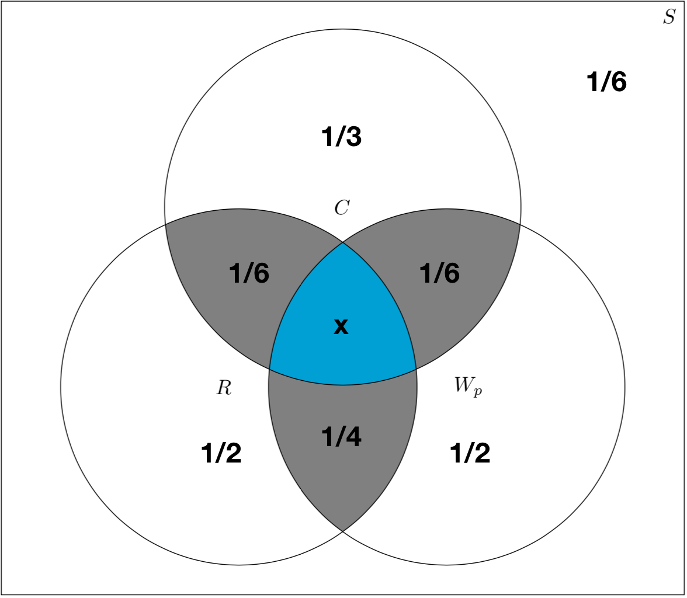

```{r setup, include=FALSE}
knitr::opts_chunk$set(echo = TRUE)
```
## Question 1

### (a)
$$ Probability\space of \space requesting\space regular\space gas,\space P(R) = 0.40 $$ 
$$ Probability\space of \space requesting\space medium\space gas,\space P(M) = 0.35 $$
$$ Probability\space of \space requesting\space premium\space gas,\space P(P) = 0.25 $$ 
$$ $$
$$ Probability\space of\space filling\space up\space when\space requesting\space regular\space gas,\space P(F|R) = 0.30 $$
$$ Probability\space of\space filling\space up\space when\space requesting\space medium\space gas,\space P(F|M) = 0.60 $$
$$ Probability\space of\space filling\space up\space when\space requesting\space premium\space gas,\space P(F|P) = 0.50 $$
$$ $$

$$ P(R \cap F) = P(F|R) P(R) = 0.30*040 = 0.12 $$

### (b)

Filling up & requesting regular, medium or premium gas are indepedant events.

$$ P(F) = P(R \cap F) + P(M \cap F) + P(P \cap F) = P(F|R)P(R) + P(F|M)P(M) + P(F|P)P(P) $$  
$$ => P(F) = 0.30*0.40 + 0.60*0.35 + 0.50*0.25 = 0.455 $$  

### (c)

$$ P(R|F) = \frac {P((R \cap F)}{P(F)} $$  
$$ => P(R|F) = \frac {0.12}{0.455} = 0.263 $$  

## Question 2


$$ Probability\space of\space red,\space P(R)= \frac{1}{2} $$  
$$ Probability\space of\space waterproof,\space P(W)= \frac{1}{2} $$  
$$ Probability\space of\space cool,\space P(C)= \frac{1}{3} $$  
$$ Probability\space of\space neither\space R,\space W\space or\space C,\space !P(R \cup W \cup C)= \frac{1}{6} $$
$$ $$  
$$ => Porbability\ of\ R\ or\ W\ or\ C\ $$  
$$ P(R \cup W \cup C) = 1 - \frac{1}{6} $$  


### (a)
<center></center>

### (b)

$$ P(R \cup W_p \cup C) = P(R) + P(W_p) + P(C) - P(R \cap W_p) - P(W_p \cap C) - P(R \cap C) + P(R \cap W_p \cap C) $$  
$$ => \frac{5}{6} = \frac{1}{2} + \frac{1}{2} + \frac{1}{3} - \frac{1}{4} - \frac{1}{6} - \frac{1}{6} + P(R \cap W_p \cap C) $$  
$$ => P(R \cap W_p \cap C)  = \frac{1}{12}$$  

### (c) 

$$ P(C'|R) = 1 - P(C|R) $$

$$ P(C|R) = \frac{P(R \cap C)}{P(R)}  = \frac{1/6}{1/2} = \frac{1}{3} $$ 

$$ P(C'|R) = 1-\frac{1}{3} = \frac{2}{3} $$

### (d)

$$ P(C | R \cup W_p) = \frac{P(C \cap (R \cup W_p)}{P(R \cup W_p)} $$  

$$ P(R \cup W_p) = P(R) + P(W_p) - P(R \cap W_p)  = \frac{1}{2} + \frac{1}{2} - \frac{1}{4} =  \frac{3}{4} $$  

$$ P(C \cup R \cup W_p) = P(C) + P(R \cup W_p)  - P(C \cap (R \cup W_p)) $$  

$$ => P(C \cap (R \cup W_p)) = \frac{5}{6} - (\frac{1}{3} + \frac{3}{4}) $$  

$$ => P(C \cap (R \cup W_p)) = \frac{1}{4} $$  

$$ P(C | R \cup W_p) = \frac{\frac{1}{4}}{\frac{3}{4}} = \frac{1}{3} $$

## Question 3

### (a)

$$ P(A) = \frac{1}{2} $$
$$ P(B) = \frac{2}{3} $$

$$ P(A \cup B) = P(A) + P(B) - P(A \cap B) $$
$$ $$

<center> For minimum $P(A \cap B)$, assume events are mutually exclusive, i.e. $P(A \cap B) = 0$ </center>

<center> Check if this is possible: </center>
$$ $$
$$ P(A \cup B)_{disjoint} = P(A) + P(B) = \frac{1}{2} + \frac{2}{3} = \frac{7}{6} > 1 $$ 
$$ $$ 
<center> => A and B cannot be mutually exclusive </center>
$$ $$ 
$$ P(A \cap B)_{min} = P(A \cup B)_{disjoint} - P(A \cup B)_{max} = \frac{7}{6} - 1 $$
$$ $$ 
$$ => P(A \cap B)_{min} = \frac{1}{6}$$
$$ $$

<center> Maximum P(A \cap B) is achieved when the events are independent events. </center>

$$ => P(A \cap B)_{max} = P(A)P(B) = \frac{1}{2} * \frac{2}{3} = \frac{1}{3}$$

### (b)

$$ P(A|B) = \frac{P(A \cap B)}{P(B)} $$

$$ P(A|B)_{max} = \frac{P(A \cap B)_{max}}{P(B)} = \frac{\frac{1}{3}}{\frac{2}{3}} = \frac{1}{2}$$

$$ $$

$$ P(A|B)_{min} = \frac{P(A \cap B)_{min}}{P(B)} = \frac{\frac{1}{6}}{\frac{2}{3}} = \frac{1}{4}$$


## Question 4

$$ Let\ probability\ of\ completing\ statistics\ = P(C)= \frac{1}{100} $$  
$$ Let\ probability\ of\ liking\ statistics\  = P(L) $$  
$$ P(L|C') = \frac{1}{4} $$  
$$ P(L|C) = \frac{3}{4} $$  
$$ P(C') = 1 - P(C)  = 1 - \frac{1}{100} = \frac{99}{100} $$  
$$ P(C|L) = \frac{P(L \cap C)}{P(L)}  = \frac{P(L|C)P(C)}{P(L)}$$  
$$ P(L) = P(L|C)P(C) + P(L|C')P(C') = \frac{3}{4}*\frac{1}{100} +  \frac{1}{4}*\frac{99}{100} $$  
$$ => P(C|L) = \frac{\frac{3}{400}}{\frac{102}{400}} = 0.0294 $$

